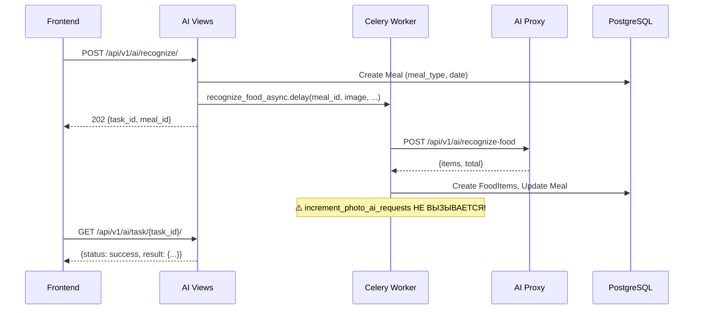
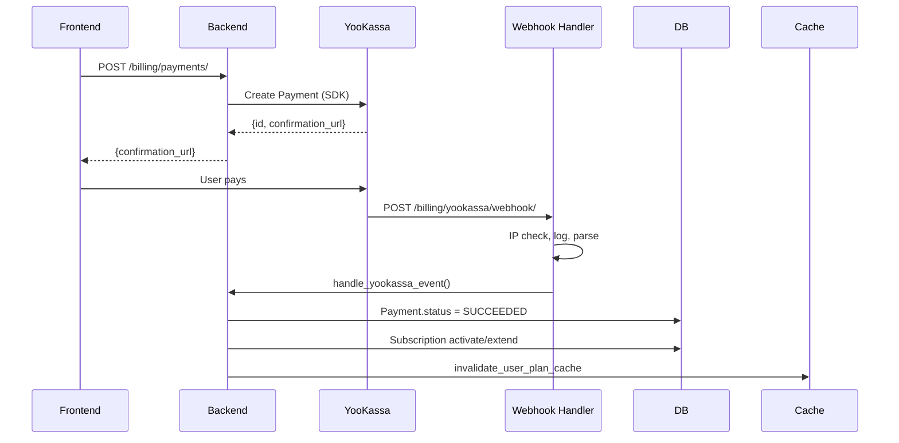

# 🔍 EatFit24 Full Audit Report

> **Дата:** 2025-12-24  
> **Scope:** Backend + AI + Nutrition/FoodLog + Telegram + Billing  
> **Режим:** Только аудит — никаких изменений кода

---

## Executive Summary

Проведён полный аудит EatFit24 backend системы. Выявлены **3 критические проблемы (P0)**, **6 важных (P1)**, и **5 минорных (P2)**.

### Главные риски:
1. **AI лимиты не списываются** — после успешного распознавания `increment_photo_ai_requests` не вызывается в async flow
2. **Legacy код создаёт путаницу** — файлы `services_legacy.py`, `tests_legacy.py` импортируют несуществующий класс
3. **Timezone несоответствие** — `date.today()` vs `timezone.now().date()` может привести к рассинхрону лимитов

### Положительные стороны:
- ✅ Биллинг webhook-логика корректна (идемпотентность, IP allowlist)
- ✅ AI Proxy архитектура чистая (client → adapter → service)
- ✅ Документация BOOT_AND_RUNTIME.md актуальна и полна
- ✅ Security secrets не захардкожены в коде

---

## 1. Архитектура (Fact-Based)

### 1.1 Backend Apps

| App | Назначение | Ключевые файлы |
|-----|-----------|----------------|
| `ai` | AI распознавание фото | [views.py](file:///d:/NICOLAS/1_PROJECTS/_IT_Projects/eatfit24/backend/apps/ai/views.py), [tasks.py](file:///d:/NICOLAS/1_PROJECTS/_IT_Projects/eatfit24/backend/apps/ai/tasks.py) |
| `ai_proxy` | HTTP клиент к AI Proxy сервису | [client.py](file:///d:/NICOLAS/1_PROJECTS/_IT_Projects/eatfit24/backend/apps/ai_proxy/client.py), [adapter.py](file:///d:/NICOLAS/1_PROJECTS/_IT_Projects/eatfit24/backend/apps/ai_proxy/adapter.py) |
| `billing` | Подписки, платежи, лимиты | [services.py](file:///d:/NICOLAS/1_PROJECTS/_IT_Projects/eatfit24/backend/apps/billing/services.py), [usage.py](file:///d:/NICOLAS/1_PROJECTS/_IT_Projects/eatfit24/backend/apps/billing/usage.py) |
| `nutrition` | FoodLog, Meal, FoodItem | [models.py](file:///d:/NICOLAS/1_PROJECTS/_IT_Projects/eatfit24/backend/apps/nutrition/models.py) |
| `telegram` | Telegram WebApp auth, bot API | [telegram_auth.py](file:///d:/NICOLAS/1_PROJECTS/_IT_Projects/eatfit24/backend/apps/telegram/telegram_auth.py) |
| `users` | User, Profile модели | `models.py`, `serializers.py` |
| `common` | Общие утилиты, validators | `validators.py`, `storage.py` |
| `core` | Django core config | `settings/*` |

### 1.2 AI Flow (Actual)



### 1.3 Billing Flow (Actual)



---

## 2. Таблица проблем

### P0 — Critical (блокируют первых пользователей)

| ID | Проблема | Файл | Impact | Root Cause |
|----|----------|------|--------|------------|
| P0-1 | **Лимиты не списываются в async flow** | [tasks.py:159-172](file:///d:/NICOLAS/1_PROJECTS/_IT_Projects/eatfit24/backend/apps/ai/tasks.py#L159-L172) | FREE пользователи имеют безлимитный AI | `increment_photo_ai_requests` не вызывается после успешного AI |
| P0-2 | **Legacy файлы импортируют несуществующий класс** | [services_legacy.py:13](file:///d:/NICOLAS/1_PROJECTS/_IT_Projects/eatfit24/backend/apps/ai/services_legacy.py#L13) | Import error при использовании | `AIProxyRecognitionService` не существует в `ai_proxy.service` |
| P0-3 | **Timezone mismatch в лимитах** | [usage.py:150](file:///d:/NICOLAS/1_PROJECTS/_IT_Projects/eatfit24/backend/apps/billing/usage.py#L150) vs [serializers.py:95](file:///d:/NICOLAS/1_PROJECTS/_IT_Projects/eatfit24/backend/apps/nutrition/serializers.py#L95) | Лимиты могут сброситься не в полночь пользователя | `date.today()` vs `timezone.now().date()` |

### P1 — Important (нужно исправить до production)

| ID | Проблема | Файл | Impact |
|----|----------|------|--------|
| P1-1 | **Документация не соответствует коду** | [limits-and-usage.md](file:///d:/NICOLAS/1_PROJECTS/_IT_Projects/eatfit24/backend/apps/billing/docs/limits-and-usage.md) | `can_analyze_photo`, `increment_usage` описаны, но не существуют |
| P1-2 | **db.sqlite3 в репозитории** | [db.sqlite3](file:///d:/NICOLAS/1_PROJECTS/_IT_Projects/eatfit24/backend/db.sqlite3) | 434KB файл, не должен быть в git |
| P1-3 | **tests_legacy.py патчит неверный путь** | [tests_legacy.py:89](file:///d:/NICOLAS/1_PROJECTS/_IT_Projects/eatfit24/backend/apps/ai/tests_legacy.py#L89) | Тесты не работают |
| P1-4 | **Нет проверки лимита ДО создания Meal** | [views.py:68-75](file:///d:/NICOLAS/1_PROJECTS/_IT_Projects/eatfit24/backend/apps/ai/views.py#L68-L75) | Meal создаётся даже если лимит исчерпан |
| P1-5 | **DEBUG_MODE_ENABLED bypass в prod** | [telegram_auth.py:121](file:///d:/NICOLAS/1_PROJECTS/_IT_Projects/eatfit24/backend/apps/telegram/telegram_auth.py#L121) | Потенциальный security bypass если флаг остался |
| P1-6 | **grams vs amount_grams inconsistency** | [tasks.py:72](file:///d:/NICOLAS/1_PROJECTS/_IT_Projects/eatfit24/backend/apps/ai/tasks.py#L72) vs [tasks.py:167](file:///d:/NICOLAS/1_PROJECTS/_IT_Projects/eatfit24/backend/apps/ai/tasks.py#L167) | `amount_grams` в JSON response, но `grams` при сохранении — KeyError |

### P2 — Minor (cleanup, не критично)

| ID | Проблема | Файл |
|----|----------|------|
| P2-1 | Legacy файлы должны быть удалены | `services_legacy.py`, `tests_legacy.py` |
| P2-2 | celerybeat-schedule в репо | [celerybeat-schedule](file:///d:/NICOLAS/1_PROJECTS/_IT_Projects/eatfit24/backend/celerybeat-schedule) |
| P2-3 | gunicorn.pid в репо | [gunicorn.pid](file:///d:/NICOLAS/1_PROJECTS/_IT_Projects/eatfit24/backend/gunicorn.pid) |
| P2-4 | Дублирование `_clamp_grams` | tasks.py и adapter.py |
| P2-5 | `admin-credentials.txt` в корне | [admin-credentials.txt](file:///d:/NICOLAS/1_PROJECTS/_IT_Projects/eatfit24/admin-credentials.txt) |

---

## 3. План рефактора

### Phase 1 — P0 Fixes (Day 1)

#### 1.1 Добавить учёт лимитов в tasks.py

```diff
# apps/ai/tasks.py, после line 172 (после transaction.atomic)

+    # 4) Инкрементируем счётчик использования ТОЛЬКО после успеха
+    from apps.billing.usage import DailyUsage
+    if user_id:
+        from django.contrib.auth import get_user_model
+        User = get_user_model()
+        try:
+            user = User.objects.get(id=user_id)
+            DailyUsage.objects.increment_photo_ai_requests(user)
+            logger.info("[AI] usage incremented user_id=%s", user_id)
+        except User.DoesNotExist:
+            logger.warning("[AI] user not found for usage increment: user_id=%s", user_id)
```

#### 1.2 Удалить legacy файлы

```bash
rm backend/apps/ai/services_legacy.py
rm backend/apps/ai/tests_legacy.py
```

#### 1.3 Унифицировать timezone

```diff
# apps/billing/usage.py line 150
- date = models.DateField("Дата", default=dt_date.today)
+ date = models.DateField("Дата", default=timezone.now().date)
```

### Phase 2 — P1 Fixes (Day 2-3)

1. Добавить проверку лимита ДО создания Meal в `views.py`
2. Удалить `db.sqlite3` из репо, добавить в `.gitignore`
3. Обновить документацию `limits-and-usage.md`
4. Исправить `grams` → `amount_grams` inconsistency в tasks.py

### Phase 3 — P2 Cleanup (Day 4)

1. Удалить runtime artifacts из репо
2. Refactor `_clamp_grams` в общий модуль
3. Проверить `admin-credentials.txt` и удалить если не нужен

---

## 4. Связанные документы

- [AUDIT_RISK_REGISTER.md](file:///d:/NICOLAS/1_PROJECTS/_IT_Projects/eatfit24/backend/docs/AUDIT_RISK_REGISTER.md) — Полный реестр рисков
- [AUDIT_DEAD_CODE.md](file:///d:/NICOLAS/1_PROJECTS/_IT_Projects/eatfit24/backend/docs/AUDIT_DEAD_CODE.md) — Мёртвый код
- [AUDIT_CONTRACTS.md](file:///d:/NICOLAS/1_PROJECTS/_IT_Projects/eatfit24/backend/docs/AUDIT_CONTRACTS.md) — API контракты
- [AUDIT_INVARIANTS.md](file:///d:/NICOLAS/1_PROJECTS/_IT_Projects/eatfit24/backend/docs/AUDIT_INVARIANTS.md) — Инварианты данных
- [AUDIT_TEST_PLAN.md](file:///d:/NICOLAS/1_PROJECTS/_IT_Projects/eatfit24/backend/docs/AUDIT_TEST_PLAN.md) — План тестирования

---

## 5. Definition of Done

- [x] Все P0 задокументированы с конкретными файлами/строками
- [x] Для каждого P0 есть fix outline
- [x] Есть список мёртвого кода с доказательствами
- [ ] Все приложения созданы и размещены

---

**Last Updated:** 2025-12-24T13:15:33+03:00
