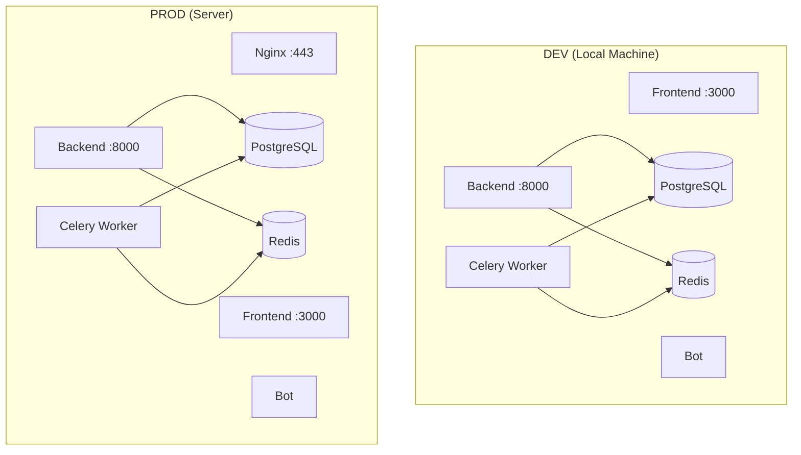

# EatFit24 - DEV/PROD Environment Audit Report

**Date:** 2026-01-09
**Version:** 1.0
**Author:** Automated Audit System

---

## Executive Summary

This audit identifies **critical issues** with environment separation in the EatFit24 project. The current architecture **lacks proper DEV/PROD isolation**, creating significant risks of accidental production data corruption or exposure.

### Key Findings

| Severity | Count | Description |
|----------|-------|-------------|
| **P0 (Critical)** | 6 | Shared resources that could cause production damage |
| **P1 (High)** | 4 | Missing isolation that creates confusion |
| **P2 (Medium)** | 5 | Documentation and convenience improvements |

---

## 1. Current Environment Scheme

### 1.1 How DEV is Currently Launched

```bash
# Development Mode
docker compose -f compose.yml -f docker-compose.dev.yml up -d
```

**Files involved:**
- `compose.yml` — base production config
- `docker-compose.dev.yml` — development overrides
- `.env` / `.env.local` — environment variables (gitignored)

**Settings:** `DJANGO_SETTINGS_MODULE=config.settings.local`

### 1.2 How PROD is Currently Launched

```bash
# Production Mode (on server)
docker compose up -d --build
```

**Files involved:**
- `compose.yml` — production config
- `.env` — production environment variables

**Settings:** `DJANGO_SETTINGS_MODULE=config.settings.production`

### 1.3 Current Architecture Diagram



---

## 2. Resource Inventory Matrix

### 2.1 PostgreSQL Database

| Resource | DEV (Current) | PROD (Current) | Status |
|----------|--------------|----------------|--------|
| **Database Name** | `eatfit24` | `eatfit24` | ⚠️ **SAME** |
| **User** | `eatfit24` | `eatfit24` | ⚠️ **SAME** |
| **Password** | From `.env.local` | From `.env` | ✅ Different |
| **Host** | `db` (Docker service) | `db` (Docker service) | N/A (isolated networks) |
| **Volume** | `eatfit24-postgres-data` | `eatfit24-postgres-data` | ⚠️ **SAME NAME** |
| **Port** | `5432` | `5432` | N/A |

### 2.2 Redis

| Resource | DEV (Current) | PROD (Current) | Status |
|----------|--------------|----------------|--------|
| **Host** | `redis` | `redis` | N/A (isolated) |
| **Cache DB** | `/0` | `/1` (production.py) | ✅ Different |
| **Celery Broker** | `/0` | `/0` | ⚠️ **SAME** |
| **Celery Result** | `/1` | `/0` | Mixed |
| **Password** | None | None | ⚠️ **No password** |
| **Key Prefix** | None | `eatfit24` | Partial |
| **Queue Names** | `ai,billing,default` | `ai,billing,default` | ⚠️ **SAME** |
| **Volume** | `eatfit24-redis-data` | `eatfit24-redis-data` | ⚠️ **SAME NAME** |

### 2.3 Media Storage

| Resource | DEV (Current) | PROD (Current) | Status |
|----------|--------------|----------------|--------|
| **Path** | `./backend/media` (bind mount) | `/var/lib/eatfit24/media` | ✅ Different |
| **Volume Type** | Bind mount | Bind mount | ✅ OK |
| **Public URL** | `http://localhost:8000/media/` | `https://eatfit24.ru/media/` | ✅ Different |

### 2.4 Telegram Bot

| Resource | DEV (Current) | PROD (Current) | Status |
|----------|--------------|----------------|--------|
| **Bot Token** | From `.env.local` | From `.env` | ⚠️ **LIKELY SAME** |
| **Webhook URL** | N/A (polling?) | `https://eatfit24.ru/...` | ✅ Different |
| **Admin Chat ID** | `310151740` | `310151740` | ⚠️ **SAME** |
| **WebApp URL** | `http://localhost:3000` | `https://eatfit24.ru/app` | ✅ Different |

### 2.5 Billing (YooKassa)

| Resource | DEV (Current) | PROD (Current) | Status |
|----------|--------------|----------------|--------|
| **Mode** | `test` (default) | `prod` | ✅ Different |
| **Shop ID** | From env | `1195531` | ✅ if separate |
| **Secret Key** | Test key | `live_YMbX...` | ✅ if separate |
| **Webhook URL** | N/A | `https://eatfit24.ru/api/billing/webhook/yookassa/` | ✅ Different |
| **Return URL** | N/A | `https://eatfit24.ru/payment-success` | ✅ Different |

### 2.6 AI Proxy

| Resource | DEV (Current) | PROD (Current) | Status |
|----------|--------------|----------------|--------|
| **URL** | From `.env` | `http://185.171.80.128:8001` | ⚠️ **SAME SERVER** |
| **Secret** | Same | Same | ⚠️ **SAME** |
| **OpenRouter Key** | Same | Same | ⚠️ **LIKELY SAME** |

### 2.7 Domains & Origins

| Resource | DEV (Current) | PROD (Current) | Status |
|----------|--------------|----------------|--------|
| **ALLOWED_HOSTS** | `localhost,127.0.0.1,...` | `eatfit24.ru,...` | ✅ Different |
| **CSRF_TRUSTED_ORIGINS** | `http://localhost:*` | `https://eatfit24.ru` | ✅ Different |
| **CORS_ALLOWED_ORIGINS** | `http://localhost:*` | From env | ✅ Different |

---

## 3. Findings by Priority

### P0 — Critical (Must Fix Immediately)

#### P0-1: No Unified APP_ENV Flag

**Problem:** There is no single `APP_ENV` variable to distinguish environments.
- Django uses `ENV` or `DJANGO_SETTINGS_MODULE`
- Bot uses `ENVIRONMENT`
- No unified logging at startup

**Risk:** Services can run with mixed/wrong configurations without detection.

**Current state:**
```yaml
# docker-compose.dev.yml
environment:
  - DJANGO_SETTINGS_MODULE=config.settings.local
  - DEBUG=True

# compose.yml (prod)
# No explicit APP_ENV, relies on DJANGO_SETTINGS_MODULE default
```

**Impact:** High — Can lead to running dev code with production data.

---

#### P0-2: Shared Database Volume Names

**Problem:** Both DEV and PROD use the same volume name `eatfit24-postgres-data`.

**Risk:** If running both environments on the same machine (testing), data will be shared/corrupted.

**Current state:**
```yaml
# compose.yml
volumes:
  postgres_data:
    name: eatfit24-postgres-data
```

**Impact:** Critical — Production data could be overwritten by dev migrations.

---

#### P0-3: Shared Redis Without Password

**Problem:** Redis has no password configured in either environment.

**Current state:**
```yaml
# compose.yml
redis:
  command: redis-server --appendonly yes  # No --requirepass
```

**Risk:** Any process that can reach the Redis port can access/modify data.

**Impact:** High — Security vulnerability and potential data mixing.

---

#### P0-4: No Startup Guards Against Cross-Environment Connection

**Problem:** Backend has basic `ENV`/`DEBUG` conflict check but no guard against:
- DEV connecting to PROD database
- DEV using PROD bot token
- DEV using PROD payment keys

**Current state in `entrypoint.sh`:**
```bash
# Only checks ENV vs DEBUG conflict
if [ "$ENV_VALUE" = "local" ] && [ "$DEBUG_LOWER" = "false" ]; then
    exit 1
fi
```

**Missing checks:**
- DB name validation against known PROD names
- Bot token validation
- Payment key mode validation

**Impact:** Critical — Prevents the most dangerous class of errors.

---

#### P0-5: Same Bot Token for DEV and PROD

**Problem:** Based on `.env.example`, there's only one `TELEGRAM_BOT_TOKEN` variable.

**Risk:** 
- DEV bot could process production user messages
- DEV webhook could override PROD webhook
- Rate limits shared

**Impact:** Critical — Production users affected by dev testing.

---

#### P0-6: Shared AI Proxy Server

**Problem:** Both DEV and PROD use the same AI Proxy at `http://185.171.80.128:8001`.

**Risk:**
- Rate limits shared
- Logs mixed
- No isolation for testing

**Impact:** High — Dev testing can exhaust production rate limits.

---

### P1 — High Priority

#### P1-1: Same Celery Queue Names

**Problem:** Both environments use `ai,billing,default` queues.

**Risk:** If Redis is accidentally shared, tasks could cross-process.

**Current state:**
```yaml
# compose.yml (prod)
command: celery -A config worker -l INFO --concurrency=2 -Q ai,billing,default

# docker-compose.dev.yml - inherits same queues
```

**Impact:** Medium — Queue contamination if Redis shared.

---

#### P1-2: No Dev Banner/Marker in UI

**Problem:** No visual indicator when running in DEV mode.

**Risk:** Users/developers might not realize they're in dev environment.

**Current state:** No `APP_ENV` check in frontend, no banner component.

**Impact:** Medium — Confusion and accidental actions.

---

#### P1-3: No Key Prefix for Redis Keys in DEV

**Problem:** DEV has no Redis key prefix, PROD has `eatfit24`.

**Current state:**
```python
# local.py
CACHES = {
    "default": {
        "BACKEND": "django.core.cache.backends.redis.RedisCache",
        "LOCATION": REDIS_URL,
        # No KEY_PREFIX
    }
}

# production.py
CACHES = {
    "default": {
        ...
        "KEY_PREFIX": "eatfit24",  # ✅ Has prefix
    }
}
```

**Impact:** Medium — Cache key collisions if Redis shared.

---

#### P1-4: Container Names Not Environment-Specific

**Problem:** Container names are the same for DEV and PROD.

**Current state:**
```yaml
container_name: eatfit24-backend
container_name: eatfit24-db
```

**Impact:** Low — Can't run both on same Docker daemon.

---

### P2 — Medium Priority (Documentation/Convenience)

#### P2-1: No Comprehensive Environment Documentation

**Problem:** `docs/env/ENV_CONTRACT.md` exists but no `docs/environments.md` with:
- Quick start commands
- Resource matrix
- Separation rules

---

#### P2-2: No `.env.example` for Each Environment

**Problem:** Single `.env.example` doesn't clearly show DEV vs PROD values.

**Recommendation:** Create `.env.development.example` and `.env.production.example`.

---

#### P2-3: No "Reset DEV" Script

**Problem:** No safe, documented way to reset DEV database without risking PROD.

---

#### P2-4: No Network Isolation Documentation

**Problem:** Docker networks are the same name, no documentation on how DEV is isolated from PROD.

---

#### P2-5: Missing YOOKASSA_MODE Check at Startup

**Problem:** No validation that YOOKASSA_MODE matches APP_ENV.

---

## 4. Risk Assessment

### 4.1 Most Dangerous Scenarios

| Scenario | Probability | Impact | Risk Score |
|----------|-------------|--------|------------|
| DEV migration runs against PROD DB | Low | Critical | High |
| DEV bot processes PROD messages | Medium | High | High |
| DEV exhausts PROD AI rate limits | High | Medium | Medium |
| Cache key collision | Low | Low | Low |

### 4.2 Current Protections (What's Working)

1. ✅ Separate Django settings files (`local.py` vs `production.py`)
2. ✅ ENV/DEBUG conflict check in entrypoint
3. ✅ Different media paths
4. ✅ YOOKASSA_MODE flag exists
5. ✅ Production.py requires credentials (fail-fast)
6. ✅ Different ALLOWED_HOSTS/CORS origins

---

## 5. Remediation Plan

### Phase 1: Critical Fixes (Day 1-2)

| ID | Task | Effort |
|----|------|--------|
| R1.1 | Introduce `APP_ENV` variable | 2h |
| R1.2 | Add environment-specific volume names | 1h |
| R1.3 | Add Redis password | 1h |
| R1.4 | Implement startup guards | 4h |
| R1.5 | Create separate DEV bot | 2h |
| R1.6 | Document AI Proxy separation | 1h |

### Phase 2: Isolation (Day 3-4)

| ID | Task | Effort |
|----|------|--------|
| R2.1 | Add `_dev` suffix to queue names | 1h |
| R2.2 | Add DEV banner component | 2h |
| R2.3 | Add Redis key prefix for DEV | 30m |
| R2.4 | Environment-specific container names | 30m |

### Phase 3: Documentation (Day 5)

| ID | Task | Effort |
|----|------|--------|
| R3.1 | Create `docs/environments.md` | 2h |
| R3.2 | Create environment-specific `.env.example` files | 1h |
| R3.3 | Create `scripts/reset-dev.sh` | 1h |
| R3.4 | Document network isolation | 1h |

---

## 6. Proposed Final Architecture

### 6.1 Environment Variable Structure

```
/.env.development.example     # Template for DEV
/.env.production.example      # Template for PROD
/.env                         # gitignored, actual values

# Key variable:
APP_ENV=dev|prod              # Single source of truth
```

### 6.2 Volume Names

```yaml
# DEV
volumes:
  postgres_data:
    name: eatfit24-dev-postgres
  redis_data:
    name: eatfit24-dev-redis

# PROD
volumes:
  postgres_data:
    name: eatfit24-prod-postgres
  redis_data:
    name: eatfit24-prod-redis
```

### 6.3 Database Names

```
DEV:  eatfit24_dev
PROD: eatfit24_prod
```

### 6.4 Redis Configuration

```yaml
# DEV
redis:
  command: redis-server --appendonly yes --requirepass ${REDIS_PASSWORD_DEV}

# PROD
redis:
  command: redis-server --appendonly yes --requirepass ${REDIS_PASSWORD_PROD}
```

### 6.5 Celery Queue Names

```
DEV:  ai_dev, billing_dev, default_dev
PROD: ai, billing, default
```

### 6.6 Startup Guards (Backend)

```python
# config/settings/production.py - add to existing checks

# Guard: Block dev-like database names in production
FORBIDDEN_PROD_DB_NAMES = ['eatfit24_dev', 'foodmind_dev', 'test', 'dev']
if DATABASES['default']['NAME'] in FORBIDDEN_PROD_DB_NAMES:
    raise RuntimeError(f"Forbidden DB name in production: {DATABASES['default']['NAME']}")

# Guard: Block test payment keys in production
if 'test_' in YOOKASSA_SECRET_KEY:
    raise RuntimeError("Test YooKassa key detected in production")

# Guard: APP_ENV validation
APP_ENV = os.environ.get('APP_ENV', 'prod')
if APP_ENV != 'prod':
    raise RuntimeError(f"APP_ENV must be 'prod' in production, got: {APP_ENV}")
```

---

## 7. Launch Commands (Target State)

### DEV Environment

```bash
# Start DEV
APP_ENV=dev docker compose -f compose.yml -f compose.dev.yml up -d

# Reset DEV database (SAFE - only affects dev)
./scripts/reset-dev.sh

# Seed DEV data
APP_ENV=dev docker compose exec backend python manage.py seed_dev

# Run DEV migrations
APP_ENV=dev docker compose exec backend python manage.py migrate
```

### PROD Environment

```bash
# Start PROD
APP_ENV=prod docker compose up -d --build

# Run PROD migrations (careful!)
APP_ENV=prod docker compose exec backend python manage.py migrate

# NEVER run these in PROD:
# ❌ reset-dev.sh
# ❌ seed_dev
# ❌ down -v
```

---

## 8. Acceptance Criteria

### 8.1 Validation Commands

```bash
# Verify volumes are different
docker compose -f compose.yml -f compose.dev.yml config | grep postgres_data
# Should show: eatfit24-dev-postgres

docker compose config | grep postgres_data
# Should show: eatfit24-prod-postgres

# Verify APP_ENV inside containers
docker compose exec backend printenv | grep APP_ENV
# Should show: APP_ENV=dev (for dev) or APP_ENV=prod (for prod)

# Verify database name
docker compose exec backend python -c "from django.conf import settings; print(settings.DATABASES['default']['NAME'])"
# Should show: eatfit24_dev (for dev) or eatfit24_prod (for prod)
```

### 8.2 Test User Isolation

1. Create user in DEV: `test-user-12345`
2. Query PROD: Should NOT exist
3. Create user in PROD: `prod-user-67890`
4. Query DEV: Should NOT exist

### 8.3 Guard Tests

```bash
# Test: DEV config with PROD DB name should fail
APP_ENV=dev POSTGRES_DB=eatfit24_prod docker compose up backend
# Expected: Container crashes with "Cannot connect to production database from dev environment"

# Test: PROD with test payment key should fail
APP_ENV=prod YOOKASSA_SECRET_KEY=test_abc123 docker compose up backend
# Expected: Container crashes with "Test YooKassa key detected in production"
```

---

## 9. Appendix

### A. Files Audited

| File | Purpose |
|------|---------|
| `compose.yml` | Production Docker Compose |
| `compose.yml.prod` | Alternative prod config (unused?) |
| `docker-compose.dev.yml` | Development overrides |
| `.env.example` | Root environment template |
| `backend/config/settings/base.py` | Django base settings |
| `backend/config/settings/local.py` | Django dev settings |
| `backend/config/settings/production.py` | Django prod settings |
| `backend/config/celery.py` | Celery configuration |
| `backend/entrypoint.sh` | Container startup script |
| `bot/.env.example` | Bot environment template |
| `bot/entrypoint.sh` | Bot startup script |
| `frontend/.env.example` | Frontend environment template |
| `frontend/nginx.conf` | Frontend container nginx |
| `nginx/eatfit24.ru` | Host nginx config |
| `docs/env/ENV_CONTRACT.md` | Environment documentation |

### B. Related Documents

- [ENV_CONTRACT.md](../docs/env/ENV_CONTRACT.md) — Variable definitions
- [ENV_SECURITY_FIX_2025-12-21.md](../docs/env/ENV_SECURITY_FIX_2025-12-21.md) — Security fixes
- [OPS_RUNBOOK.md](../docs/OPS_RUNBOOK.md) — Operations guide

---

## 10. Sign-off

| Role | Name | Date | Status |
|------|------|------|--------|
| Audit Author | System | 2026-01-09 | Complete |
| Lead Developer | Pending | - | Pending Review |
| DevOps | Pending | - | Pending Review |
