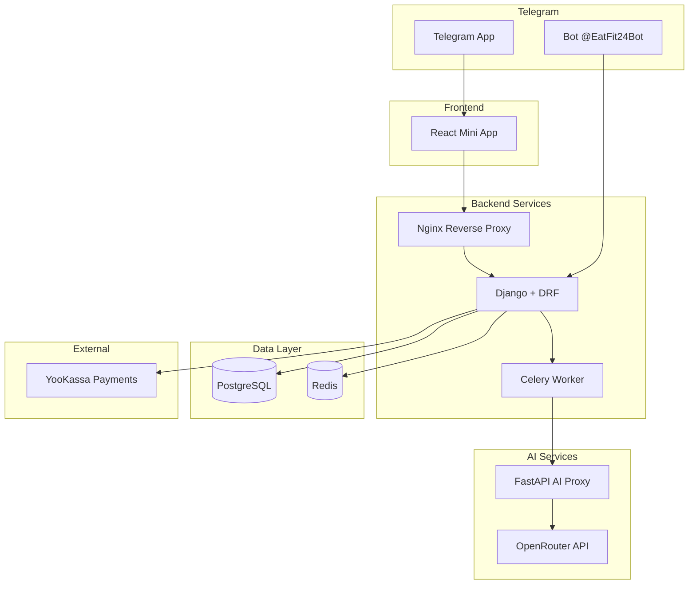

# EatFit24 — Project Structure

Technical documentation for engineering team onboarding and project architecture reference.

---

## 1. Overview

**EatFit24** — это комплексное приложение для контроля питания с AI-распознаванием еды, интегрированное с Telegram.

### Компоненты системы

| Компонент | Технологии | Назначение |
|-----------|------------|------------|
| **Frontend Mini App** | React 19, TypeScript, Vite, TailwindCSS | Telegram WebApp для дневника питания |
| **Backend API** | Django 4.x, DRF, PostgreSQL, Redis, Celery | REST API, бизнес-логика, аутентификация |
| **AI Proxy** | FastAPI, Pydantic | Прокси к OpenRouter для AI-распознавания фото еды |
| **Telegram Bot** | aiogram, SQLAlchemy | Онбординг, личные планы питания, лид-магнит |

### Взаимодействие компонентов

```
Telegram WebApp (initData)
         │
         ▼
    ┌─────────────────┐
    │  Frontend       │  React Mini App
    │  (Mini App)     │  eatfit24.ru
    └────────┬────────┘
             │ REST API (X-Telegram-Init-Data)
             ▼
    ┌─────────────────┐     ┌──────────────┐
    │  Backend        │────▶│  PostgreSQL  │
    │  (Django + DRF) │     └──────────────┘
    └────────┬────────┘
             │                   ┌──────────────┐
             ├──────────────────▶│  Redis       │
             │  Celery Broker    │  (Broker)    │
             │                   └──────────────┘
             │
             │ HTTP (X-API-Key)
             ▼
    ┌─────────────────┐
    │  AI Proxy       │────────▶ OpenRouter API
    │  (FastAPI)      │          (LLM Vision)
    └─────────────────┘

    ┌─────────────────┐
    │  Telegram Bot   │────────▶ Backend API
    │  (aiogram)      │          (Personal Plans)
    └─────────────────┘
```

---

## 2. Общая архитектура



### Docker Compose сервисы

| Сервис | Container | Port | Описание |
|--------|-----------|------|----------|
| `db` | `fm-db` | 5432 | PostgreSQL 15 |
| `redis` | `fm-redis` | 6379 | Redis 7 Alpine |
| `backend` | `fm-backend` | 8000 | Django API |
| `celery-worker` | `fm-celery-worker` | - | Celery Worker (4 workers) |
| `bot` | `fm-bot` | - | Telegram Bot |
| `frontend` | `fm-frontend` | 3000 | React Mini App (Nginx) |

---

## 3. Структура Frontend (React Mini App)

```
frontend/
├── src/
│   ├── pages/                    # Экранные компоненты
│   │   ├── FoodLogPage.tsx       # Главная — дневник питания
│   │   ├── MealDetailsPage.tsx   # Детали приёма пищи
│   │   ├── ProfilePage.tsx       # Профиль пользователя
│   │   ├── SettingsPage.tsx      # Настройки
│   │   ├── SubscriptionPage.tsx  # Страница подписки
│   │   ├── PaymentHistoryPage.tsx# История платежей
│   │   ├── ClientsPage.tsx       # Список клиентов (тренер)
│   │   ├── ClientDashboard.tsx   # Дашборд клиента (тренер)
│   │   └── ApplicationsPage.tsx  # Заявки (тренер)
│   │
│   ├── components/               # Переиспользуемые компоненты
│   │   ├── Dashboard.tsx         # Круговой график макросов
│   │   ├── Calendar.tsx          # Календарь дат
│   │   ├── MacroChart.tsx        # Визуализация КБЖУ
│   │   ├── Layout.tsx            # Основной layout с навигацией
│   │   ├── Toast.tsx             # Уведомления
│   │   ├── ErrorBoundary.tsx     # Обработка ошибок
│   │   ├── PullToRefresh.tsx     # Pull-to-refresh
│   │   ├── AuthErrorModal.tsx    # Модал ошибки авторизации
│   │   └── BatchResultsModal.tsx # Результаты пакетного анализа
│   │
│   ├── services/
│   │   ├── api/
│   │   │   ├── client.ts         # HTTP-клиент, fetchWithTimeout, error handling
│   │   │   ├── urls.ts           # Константы URL эндпоинтов
│   │   │   ├── types.ts          # Общие типы API
│   │   │   ├── auth.ts           # Telegram WebApp авторизация
│   │   │   ├── ai.ts             # AI распознавание (sync/async)
│   │   │   ├── nutrition.ts      # Работа с meals и food items
│   │   │   ├── billing.ts        # Подписки и платежи
│   │   │   ├── profile.ts        # Профиль пользователя
│   │   │   └── index.ts          # Реэкспорт
│   │   └── api.ts                # Legacy API модуль
│   │
│   ├── hooks/
│   │   ├── useApiError.ts        # Централизованная обработка API ошибок
│   │   ├── useErrorHandler.tsx   # Error boundary hooks
│   │   ├── useTaskPolling.ts     # Polling статуса async задач
│   │   ├── useProfile.ts         # Работа с профилем
│   │   ├── useTelegramWebApp.ts  # Интеграция с Telegram WebApp SDK
│   │   ├── useOnlineStatus.ts    # Детекция offline/online
│   │   └── useDebounce.ts        # Debounce хук
│   │
│   ├── contexts/
│   │   ├── AuthContext.tsx       # Контекст авторизации (Telegram initData)
│   │   ├── BillingContext.tsx    # Контекст подписки и лимитов
│   │   ├── ToastContext.tsx      # Контекст уведомлений
│   │   ├── ThemeContext.tsx      # Тема (light/dark)
│   │   └── ClientsContext.tsx    # Клиенты тренера
│   │
│   ├── lib/
│   │   └── telegram.ts           # Утилиты Telegram WebApp
│   │
│   ├── utils/
│   │   ├── mifflin.ts            # Формула Mifflin-St Jeor (КБЖУ)
│   │   ├── imageUtils.ts         # Конвертация HEIC, resize
│   │   └── platform.ts           # Детекция платформы
│   │
│   ├── types/
│   │   ├── telegram.d.ts         # Типы Telegram WebApp SDK
│   │   ├── profile.ts            # Типы профиля
│   │   ├── billing.ts            # Типы биллинга
│   │   └── application.ts        # Типы заявок
│   │
│   ├── constants/
│   │   └── index.ts              # Константы приложения
│   │
│   ├── App.tsx                   # Root компонент с роутингом
│   ├── main.tsx                  # Entry point
│   └── mockTelegram.ts           # Мок для dev-режима без Telegram
│
├── public/                       # Статика
├── vite.config.ts                # Конфиг Vite
├── tailwind.config.js            # Конфиг TailwindCSS
├── tsconfig.json                 # TypeScript конфиг
├── package.json                  # Зависимости
└── Dockerfile                    # Production build
```

### Ключевые модули Frontend

| Модуль | Описание |
|--------|----------|
| `services/api/client.ts` | HTTP-клиент с retry, timeout, unified error format |
| `services/api/ai.ts` | AI Recognition: sync (200) / async (202) + polling |
| `hooks/useTaskPolling.ts` | Polling async задач с exponential backoff |
| `contexts/AuthContext.tsx` | Telegram WebApp авторизация через `initData` |
| `lib/telegram.ts` | Обёртка над `window.Telegram.WebApp` |

---

## 4. Структура Backend (Django + DRF)

```
backend/
├── config/
│   ├── settings/
│   │   ├── base.py               # Общие настройки
│   │   ├── local.py              # Development
│   │   ├── production.py         # Production
│   │   └── test.py               # Тесты
│   ├── urls.py                   # Главный роутер
│   ├── celery.py                 # Конфигурация Celery
│   ├── wsgi.py                   # WSGI entry
│   └── asgi.py                   # ASGI entry
│
├── apps/
│   ├── core/                     # Базовые классы и утилиты
│   │   ├── exceptions.py         # Иерархия исключений (FoodMindException)
│   │   └── exception_handler.py  # Unified error handler для DRF
│   │
│   ├── common/                   # Общие утилиты
│   │   ├── views.py              # Health checks (/, /health/, /ready/, /live/)
│   │   ├── storage.py            # Upload paths для медиа
│   │   ├── validators.py         # Валидаторы (FileSizeValidator, ImageDimensionValidator)
│   │   ├── image_utils.py        # Обработка изображений
│   │   ├── logging.py            # Настройка логирования
│   │   └── audit.py              # Аудит-логирование
│   │
│   ├── users/                    # Пользователи и профили
│   │   ├── models.py             # Profile (gender, weight, height, goals, avatar)
│   │   ├── views.py              # ProfileView, UploadAvatarView, DeleteAccountView
│   │   ├── serializers.py        # ProfileSerializer
│   │   └── urls.py               # /api/v1/users/*
│   │
│   ├── telegram/                 # Telegram интеграция
│   │   ├── models.py             # TelegramUser, PersonalPlanSurvey, PersonalPlan
│   │   ├── views/
│   │   │   ├── auth.py           # telegram_auth, webapp_auth
│   │   │   ├── bot.py            # Эндпоинты для бота
│   │   │   └── admin.py          # Trainer admin panel
│   │   ├── authentication.py     # TelegramAuthentication class
│   │   ├── services/
│   │   │   └── webapp_auth.py    # Валидация Telegram initData (HMAC-SHA256)
│   │   ├── urls.py               # /api/v1/telegram/*
│   │   └── trainer_urls.py       # /api/v1/trainer-panel/*
│   │
│   ├── nutrition/                # Дневник питания
│   │   ├── models.py             # Meal, FoodItem, DailyGoal
│   │   ├── views.py              # MealListCreateView, FoodItemDetailView, DailyGoalView
│   │   ├── serializers.py        # MealSerializer, FoodItemSerializer
│   │   ├── services.py           # Расчёт КБЖУ, агрегация
│   │   └── urls.py               # /api/v1/meals/*, /api/v1/goals/*
│   │
│   ├── ai/                       # AI Recognition
│   │   ├── views.py              # AIRecognitionView, TaskStatusView
│   │   ├── tasks.py              # Celery tasks: recognize_food_async
│   │   ├── services.py           # Sync recognition flow
│   │   ├── serializers.py        # RecognitionRequestSerializer
│   │   ├── throttles.py          # AI-specific rate limiting
│   │   └── urls.py               # /api/v1/ai/*
│   │
│   ├── ai_proxy/                 # Клиент для AI Proxy сервиса
│   │   ├── client.py             # HTTP-клиент к AI Proxy
│   │   ├── service.py            # AIProxyRecognitionService
│   │   ├── adapter.py            # Адаптер ответов AI
│   │   ├── exceptions.py         # AIProxyException
│   │   └── utils.py              # Утилиты (base64, retry)
│   │
│   ├── billing/                  # Подписки и платежи
│   │   ├── models.py             # SubscriptionPlan, Subscription, Payment, Refund, WebhookLog
│   │   ├── views.py              # get_subscription_plans, create_payment, toggle_auto_renew
│   │   ├── services.py           # Логика подписок, продление
│   │   ├── usage.py              # DailyUsage — учёт лимитов
│   │   ├── yookassa_client.py    # Клиент YooKassa API
│   │   ├── webhooks/
│   │   │   ├── views.py          # yookassa_webhook endpoint
│   │   │   └── handlers.py       # Обработчики событий payment.succeeded и т.д.
│   │   └── urls.py               # /api/v1/billing/*
│   │
│   └── ...
│
├── manage.py
├── gunicorn_config.py            # Gunicorn настройки
├── requirements.txt              # Python зависимости
└── Dockerfile                    # Production image
```

### Приложения Backend

| App | Назначение | Ключевые модели |
|-----|------------|-----------------|
| `core` | Базовые exceptions, unified error handler | — |
| `common` | Health checks, validators, storage | — |
| `users` | Профили пользователей | `Profile` |
| `telegram` | Telegram авторизация, Personal Plans | `TelegramUser`, `PersonalPlanSurvey`, `PersonalPlan` |
| `nutrition` | Дневник питания, КБЖУ | `Meal`, `FoodItem`, `DailyGoal` |
| `ai` | AI Recognition endpoints | — (данные в `FoodItem`) |
| `ai_proxy` | HTTP-клиент к FastAPI AI Proxy | — |
| `billing` | Подписки, платежи, YooKassa | `SubscriptionPlan`, `Subscription`, `Payment` |

### Unified Error Format

```json
{
  "error": {
    "code": "DAILY_LIMIT_REACHED",
    "message": "Достигнут дневной лимит распознаваний",
    "details": {
      "limit": 3,
      "used": 3,
      "reset_at": "2024-01-16T00:00:00Z"
    }
  }
}
```

### Иерархия исключений

```
FoodMindException (base)
├── ValidationError (400)
├── NotFoundError (404)
│   ├── UserNotFoundError
│   └── PlanNotFoundError
├── PermissionDeniedError (403)
├── BusinessLogicError (409)
│   ├── DailyLimitExceededError (429)
│   ├── SubscriptionRequiredError
│   ├── InvalidStateError
│   ├── NotAvailableForFreeError
│   └── ActiveSubscriptionError
└── ExternalServiceError (502)
    ├── AIServiceError
    ├── AIServiceTimeoutError
    └── PaymentServiceError
```

---

## 5. Структура AI Proxy (FastAPI)

```
eatfit24-ai-proxy/
├── app/
│   ├── main.py                   # FastAPI app, endpoints
│   ├── config.py                 # Settings (pydantic-settings)
│   ├── schemas.py                # Pydantic models (FoodItem, RecognizeFoodResponse)
│   ├── openrouter_client.py      # HTTP-клиент к OpenRouter API
│   └── auth.py                   # API Key verification (X-API-Key)
│
├── docs/
│   ├── API_DOCS.md               # Документация API
│   ├── DEPLOYMENT.md             # Инструкции деплоя
│   └── PROJECT_DESCRIPTION.md    # Описание проекта
│
├── requirements.txt              # Python зависимости
├── Dockerfile                    # Production image
└── docker-compose.yml            # Local development
```

### Endpoints AI Proxy

| Method | Endpoint | Описание |
|--------|----------|----------|
| `GET` | `/health` | Basic health check |
| `GET` | `/health/live` | Liveness probe |
| `GET` | `/health/ready` | Readiness probe (проверяет конфиг) |
| `POST` | `/api/v1/ai/recognize-food` | AI распознавание еды |

### Request/Response

**Request:**
```
POST /api/v1/ai/recognize-food
Content-Type: multipart/form-data
X-API-Key: <AI_PROXY_SECRET>

image: <file>
user_comment: "Салат с курицей" (optional)
locale: "ru" (default)
```

**Response:**
```json
{
  "items": [
    {
      "name": "Куриная грудка",
      "grams": 150,
      "kcal": 247.5,
      "protein": 46.5,
      "fat": 5.25,
      "carbohydrates": 0
    }
  ],
  "total": {
    "kcal": 450,
    "protein": 52,
    "fat": 15,
    "carbohydrates": 25
  },
  "model_notes": "Detected grilled chicken breast with vegetables"
}
```

### Интеграция с OpenRouter

AI Proxy использует OpenRouter API для vision моделей:
- Model: настраивается через `OPENROUTER_MODEL` (default: `meta-llama/llama-3.1-70b-instruct`)
- Multipart image upload → base64 encoding → OpenRouter chat/completions API
- Structured JSON response parsing

---

## 6. Структура Telegram Bot (aiogram)

```
bot/
├── app/
│   ├── __main__.py               # Entry point
│   ├── config.py                 # Settings (pydantic-settings)
│   │
│   ├── handlers/                 # Обработчики команд и callback
│   │   ├── survey/               # Онбординг опрос
│   │   │   ├── commands.py       # /start, /survey
│   │   │   ├── gender.py         # Выбор пола
│   │   │   ├── metrics.py        # Возраст, рост, вес
│   │   │   ├── activity.py       # Уровень активности
│   │   │   ├── training_goals.py # Цели тренировок
│   │   │   ├── body_types.py     # Выбор типа фигуры
│   │   │   ├── health.py         # Ограничения по здоровью
│   │   │   ├── timezone.py       # Часовой пояс
│   │   │   ├── confirmation.py   # Подтверждение и генерация плана
│   │   │   └── navigation.py     # Навигация (назад/вперёд)
│   │   └── __init__.py
│   │
│   ├── states/                   # FSM состояния
│   │   └── survey.py             # SurveyStates (gender, age, height, ...)
│   │
│   ├── keyboards/                # Клавиатуры
│   │   └── survey.py             # Inline keyboards для опроса
│   │
│   ├── services/
│   │   ├── ai/
│   │   │   └── openrouter.py     # Прямой клиент OpenRouter (для планов)
│   │   ├── database/
│   │   │   ├── session.py        # Async SQLAlchemy session
│   │   │   └── repository.py     # CRUD операции
│   │   ├── backend_api.py        # Клиент Django Backend API
│   │   ├── django_integration.py # Интеграция с Django (отправка опросов/планов)
│   │   ├── events.py             # Event tracking
│   │   └── image_sender.py       # Отправка изображений типов фигуры
│   │
│   ├── schemas/
│   │   └── django_api.py         # Pydantic схемы для Django API
│   │
│   ├── models/                   # SQLAlchemy models (локальная БД бота)
│   │   ├── base.py               # Base model
│   │   ├── user.py               # BotUser
│   │   └── survey.py             # SurveyAnswer (legacy, мигрируется в Django)
│   │
│   ├── prompts/
│   │   └── personal_plan.py      # Промпты для AI генерации планов
│   │
│   ├── texts/                    # Тексты сообщений
│   │   ├── start.py              # Приветственные сообщения
│   │   └── survey.py             # Тексты опроса
│   │
│   ├── validators/               # Валидаторы ввода
│   │   ├── survey.py             # Валидация ответов опроса
│   │   └── ai_response.py        # Валидация AI ответов
│   │
│   ├── constants/
│   │   └── survey.py             # Константы опроса
│   │
│   ├── utils/
│   │   ├── logger.py             # Настройка логирования
│   │   ├── paths.py              # Пути к ресурсам
│   │   ├── pii_masking.py        # Маскирование PII в логах
│   │   └── secret_filter.py      # Фильтрация секретов
│   │
│   └── assets/
│       └── body_types/           # Изображения типов фигуры
│           ├── male/
│           │   ├── now/          # Текущий тип (1-4)
│           │   └── ideal/        # Идеальный тип (1-3)
│           └── female/
│               ├── now/
│               └── ideal/
│
├── alembic/                      # Миграции БД бота
│   └── versions/
│
├── tests/                        # Тесты
├── main.py                       # Alternative entry point
├── requirements.txt              # Зависимости
├── pyproject.toml                # Poetry/Ruff конфиг
└── Dockerfile                    # Production image
```

### Flow онбординга (Personal Plan)

```
/start
   │
   ▼
┌──────────────┐
│ Выбор пола   │ gender.py
└──────┬───────┘
       │
       ▼
┌──────────────┐
│ Возраст      │ metrics.py
└──────┬───────┘
       │
       ▼
┌──────────────┐
│ Рост (см)    │ metrics.py
└──────┬───────┘
       │
       ▼
┌──────────────┐
│ Вес (кг)     │ metrics.py
└──────┬───────┘
       │
       ▼
┌──────────────┐
│ Целевой вес  │ metrics.py
└──────┬───────┘
       │
       ▼
┌──────────────────┐
│ Уровень          │ activity.py
│ активности       │
└──────┬───────────┘
       │
       ▼
┌──────────────────┐
│ Уровень          │ training_goals.py
│ тренированности  │
└──────┬───────────┘
       │
       ▼
┌──────────────────┐
│ Цели             │ training_goals.py
│ (множ. выбор)    │
└──────┬───────────┘
       │
       ▼
┌──────────────────┐
│ Ограничения      │ health.py
│ по здоровью      │
└──────┬───────────┘
       │
       ▼
┌──────────────────┐
│ Текущий тип      │ body_types.py (фото)
│ фигуры           │
└──────┬───────────┘
       │
       ▼
┌──────────────────┐
│ Идеальный тип    │ body_types.py (фото)
│ фигуры           │
└──────┬───────────┘
       │
       ▼
┌──────────────────┐
│ Часовой пояс     │ timezone.py
└──────┬───────────┘
       │
       ▼
┌──────────────────┐
│ Подтверждение    │ confirmation.py
│ и генерация AI   │
└──────────────────┘
       │
       ▼
  Django API:
  - POST /telegram/users/get-or-create/
  - POST /telegram/personal-plan/survey/
  - POST /telegram/personal-plan/plan/
```

### Связь с Backend API

Бот использует `backend_api.py` для синхронизации данных с Django:
1. Создание/получение пользователя по `telegram_id`
2. Сохранение результатов опроса (`PersonalPlanSurvey`)
3. Сохранение AI-генерированного плана (`PersonalPlan`)
4. Проверка лимитов планов в день

---

## 7. Инфраструктура и DevOps

### 7.1 Docker Compose Services

```yaml
services:
  db:           # PostgreSQL 15
  redis:        # Redis 7 Alpine (broker + result backend)
  backend:      # Django + DRF (port 8000)
  celery-worker:# Celery Worker (4 concurrency, queues: ai, billing, default)
  bot:          # Telegram Bot (aiogram)
  frontend:     # React Mini App (Nginx, port 3000)
```

### 7.2 Переменные окружения (.env)

```bash
# Database
POSTGRES_DB=foodmind
POSTGRES_USER=foodmind
POSTGRES_PASSWORD=<secret>

# Django
SECRET_KEY=<secret>
DEBUG=False
ALLOWED_HOSTS=eatfit24.ru,www.eatfit24.ru
CORS_ALLOWED_ORIGINS=https://eatfit24.ru

# Telegram
TELEGRAM_BOT_TOKEN=<bot_token>
BOT_ADMIN_ID=<admin_telegram_id>

# AI
OPENROUTER_API_KEY=<openrouter_key>
AI_PROXY_URL=http://ai-proxy:8001
AI_PROXY_SECRET=<proxy_secret>

# YooKassa
YOOKASSA_MODE=test|live
YOOKASSA_SHOP_ID_TEST=<shop_id>
YOOKASSA_API_KEY_TEST=<api_key>
YOOKASSA_RETURN_URL=https://eatfit24.ru/subscription

# Celery
CELERY_BROKER_URL=redis://redis:6379/0
CELERY_RESULT_BACKEND=redis://redis:6379/0
AI_ASYNC_ENABLED=True
```

### 7.3 Логи и мониторинг

| Компонент | Путь логов | Формат |
|-----------|------------|--------|
| Backend | `/app/logs/django.log` | JSON structured |
| Celery Worker | `/app/logs/celery.log` | JSON structured |
| Bot | `/app/logs/bot.log` | Rotating file (10MB × 5) |
| AI Proxy | stdout | JSON (uvicorn) |

Health endpoints:
- Backend: `GET /health/`, `GET /ready/`, `GET /live/`
- AI Proxy: `GET /health`, `GET /health/live`, `GET /health/ready`

### 7.4 Deploy Pipeline

```bash
# 1. Build frontend
cd frontend && npm run build

# 2. Build Docker images
docker-compose build

# 3. Run migrations
docker-compose run --rm backend python manage.py migrate

# 4. Collect static
docker-compose run --rm backend python manage.py collectstatic --noinput

# 5. Start services
docker-compose up -d

# 6. Verify health
curl https://eatfit24.ru/health/
```

---

## 8. Жизненный цикл запроса

### 8.1 Авторизация через Telegram WebApp

```
1. Пользователь открывает Mini App из Telegram
2. Telegram передаёт initData (hash, user, auth_date, ...)
3. Frontend извлекает initData через Telegram.WebApp.initData
4. Frontend отправляет запрос с Header:
   X-Telegram-Init-Data: <initData>
5. Backend валидирует HMAC-SHA256:
   - data_check_string = sorted(params, "&")
   - secret_key = HMAC-SHA256(bot_token, "WebAppData")
   - hash = HMAC-SHA256(data_check_string, secret_key)
   - Сравнивает с переданным hash
6. При успехе:
   - Создаёт/находит User + TelegramUser
   - Возвращает JWT токен или устанавливает сессию
```

### 8.2 AI-анализ фото (Async Flow)

```
1. Frontend: POST /api/v1/ai/recognize/
   - multipart/form-data: image, meal_type, date
   - Header: X-Telegram-Init-Data

2. Backend (AIRecognitionView):
   - Проверка авторизации
   - Проверка лимитов (DailyUsage)
   - Создание Meal с photo
   - Запуск Celery task: recognize_food_async.delay()
   - Response 202: { task_id, meal_id, status: "processing" }

3. Celery Worker (recognize_food_async):
   - Загружает image из Meal
   - Вызывает AIProxyRecognitionService.recognize_food()
   - AI Proxy → OpenRouter API (vision model)
   - Парсит JSON ответ
   - Создаёт FoodItem записи
   - Обновляет DailyUsage
   - Сохраняет результат в Celery result backend

4. Frontend (useTaskPolling):
   - Polling: GET /api/v1/ai/task/<task_id>/
   - Exponential backoff: 1s → 2s → 4s → ...
   - Получает state: PENDING | STARTED | SUCCESS | FAILURE
   - При SUCCESS: отображает recognized_items
```

### 8.3 Покупка подписки (YooKassa)

```
1. Frontend: POST /api/v1/billing/create-payment/
   { plan_code: "PRO_MONTHLY", save_payment_method: true }

2. Backend:
   - Создаёт Payment (status: PENDING)
   - Вызывает YooKassa API: create payment
   - Response: { confirmation_url, payment_id }

3. Frontend: redirect → confirmation_url (YooKassa checkout)

4. Пользователь оплачивает

5. YooKassa: POST /api/v1/billing/webhooks/yookassa
   { event: "payment.succeeded", object: { id, status, ... } }

6. Backend (webhook handler):
   - Проверяет подпись webhook
   - Идемпотентность: проверяет webhook_processed_at
   - Обновляет Payment.status = SUCCEEDED
   - Создаёт/продлевает Subscription
   - Сохраняет payment_method_id для автопродления

7. Frontend (return_url):
   - Показывает страницу подписки
   - Polling или refresh для обновления статуса
```

---

## 9. API Endpoints Map

### Authentication

```
POST /api/v1/telegram/auth/          # Legacy auth
POST /api/v1/telegram/webapp/auth/   # WebApp auth (primary)
```

### Users & Profile

```
GET    /api/v1/users/profile/         # Получить профиль
PATCH  /api/v1/users/profile/         # Обновить профиль
POST   /api/v1/users/profile/avatar/  # Загрузить аватар
DELETE /api/v1/users/profile/delete/  # Удалить аккаунт
```

### AI Recognition

```
POST /api/v1/ai/recognize/            # Распознать еду (sync/async)
GET  /api/v1/ai/task/<task_id>/       # Статус async задачи
```

### Nutrition (Meals)

```
GET    /api/v1/meals/?date=YYYY-MM-DD  # Список приёмов пищи за день
POST   /api/v1/meals/                   # Создать приём пищи
GET    /api/v1/meals/<id>/              # Детали приёма
PATCH  /api/v1/meals/<id>/              # Обновить приём
DELETE /api/v1/meals/<id>/              # Удалить приём

POST   /api/v1/meals/<meal_id>/items/       # Добавить блюдо
GET    /api/v1/meals/<meal_id>/items/<id>/  # Детали блюда
PATCH  /api/v1/meals/<meal_id>/items/<id>/  # Обновить блюдо
DELETE /api/v1/meals/<meal_id>/items/<id>/  # Удалить блюдо
```

### Nutrition (Goals)

```
GET    /api/v1/goals/                  # Текущая цель КБЖУ
POST   /api/v1/goals/calculate/        # Рассчитать цель (Mifflin-St Jeor)
POST   /api/v1/goals/set-auto/         # Установить авто-цель
PATCH  /api/v1/goals/                  # Ручная цель
```

### Statistics

```
GET /api/v1/stats/weekly/              # Недельная статистика
```

### Billing

```
GET  /api/v1/billing/plans/                    # Все тарифные планы
GET  /api/v1/billing/plan                      # Текущий план пользователя
GET  /api/v1/billing/me/                       # Статус подписки
POST /api/v1/billing/create-payment/           # Создать платёж
POST /api/v1/billing/bind-card/start/          # Привязать карту (1₽)
POST /api/v1/billing/auto-renew/toggle         # Вкл/выкл автопродление
GET  /api/v1/billing/payments                  # История платежей

# Settings screen
GET  /api/v1/billing/subscription/             # Детали подписки
POST /api/v1/billing/subscription/autorenew/   # Установить автопродление
GET  /api/v1/billing/payment-method/           # Привязанная карта
GET  /api/v1/billing/payments/                 # История платежей (новый)

# Webhooks
POST /api/v1/billing/webhooks/yookassa         # YooKassa webhook
```

### Telegram (Bot Integration)

```
POST /api/v1/telegram/users/get-or-create/    # Создать/получить пользователя
POST /api/v1/telegram/personal-plan/survey/   # Сохранить опрос
POST /api/v1/telegram/personal-plan/plan/     # Сохранить план
GET  /api/v1/telegram/personal-plan/count-today/ # Счётчик планов за день
GET  /api/v1/telegram/profile/                # Telegram профиль
POST /api/v1/telegram/save-test/              # Сохранить результаты AI теста

# Trainer Panel
GET  /api/v1/telegram/applications/           # Список заявок
GET  /api/v1/telegram/clients/                # Список клиентов
GET  /api/v1/telegram/clients/<id>/           # Детали клиента
GET  /api/v1/telegram/invite-link/            # Ссылка-приглашение
```

### Health Checks

```
GET /health/       # Basic health
GET /ready/        # Readiness (DB, Redis)
GET /live/         # Liveness
```

---

## 10. Типичные ошибки и коды

| Код ошибки | HTTP | Описание |
|------------|------|----------|
| `VALIDATION_ERROR` | 400 | Ошибка валидации данных |
| `INVALID_IMAGE` | 400 | Неверный формат изображения |
| `UNAUTHORIZED` | 401 | Требуется авторизация |
| `FORBIDDEN` | 403 | Доступ запрещён |
| `NOT_FOUND` | 404 | Ресурс не найден |
| `user_not_found` | 404 | Пользователь не найден |
| `plan_not_found` | 404 | Тарифный план не найден |
| `DAILY_LIMIT_REACHED` | 429 | Достигнут дневной лимит |
| `NOT_AVAILABLE_FOR_FREE` | 409 | Функция только для PRO |
| `ACTIVE_SUBSCRIPTION` | 409 | Уже есть активная подписка |
| `NO_PAYMENT_METHOD` | 409 | Нет привязанной карты для автопродления |
| `subscription_required` | 409 | Требуется активная подписка |
| `AI_SERVICE_TIMEOUT` | 502 | Таймаут AI сервиса |
| `AI_RECOGNITION_FAILED` | 502 | Ошибка распознавания AI |
| `PAYMENT_ERROR` | 502 | Ошибка создания платежа |
| `ai_service_error` | 502 | Ошибка AI сервиса |
| `payment_service_error` | 502 | Ошибка платёжного сервиса |
| `INTERNAL_ERROR` | 500 | Внутренняя ошибка сервера |

---

## Приложения

### Используемые технологии

**Frontend:**
- React 19
- TypeScript 5.x
- Vite 7
- TailwindCSS 3
- React Router 7
- Chart.js / react-chartjs-2
- heic2any (HEIC → JPEG)

**Backend:**
- Python 3.11+
- Django 4.x
- Django REST Framework
- PostgreSQL 15
- Redis 7
- Celery 5.x
- Gunicorn

**AI Proxy:**
- Python 3.11+
- FastAPI
- Pydantic 2.x
- httpx (async HTTP)
- uvicorn

**Telegram Bot:**
- Python 3.11+
- aiogram 3.x
- SQLAlchemy (async)
- Pydantic Settings

**Infrastructure:**
- Docker + Docker Compose
- Nginx (frontend serving)
- YooKassa (payments)
- OpenRouter API (AI vision)

---

*Документ создан: 2024-12*
*Версия: 1.0*